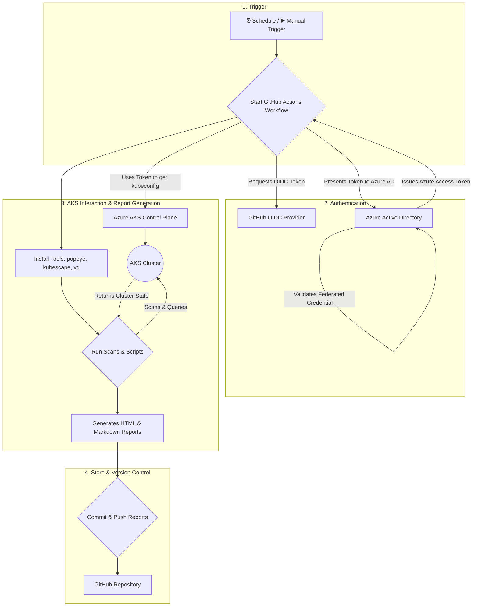
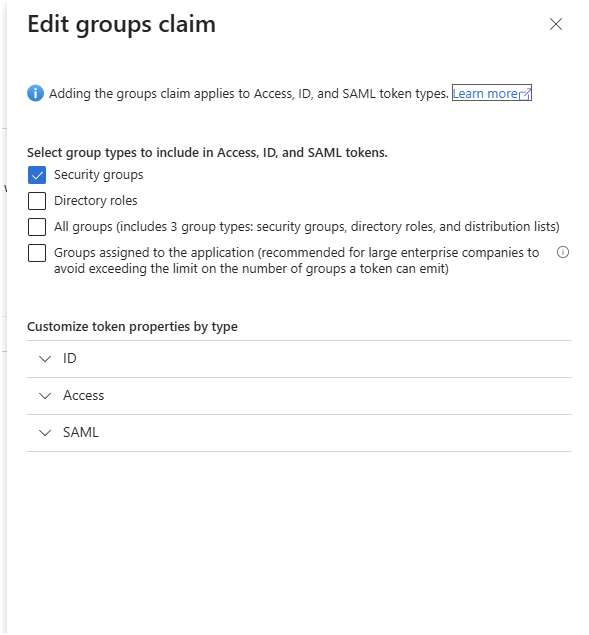

# Automated AKS Workload Documentation Generator

This repository contains a complete, automated solution for generating daily documentation about the workloads and security posture of an Azure Kubernetes Service (AKS) cluster. It uses a GitHub Actions workflow to run a suite of powerful open-source tools, generating reports in easy-to-read formats like Markdown and HTML, and then commits them back to this repository.

This provides a version-controlled, historical record of your cluster's state, which is invaluable for auditing, compliance, onboarding, and operational awareness.

> **Security Enhancement**: This workflow uses OIDC (OpenID Connect) to establish a federated identity trust between GitHub Actions and Azure. This modern approach is more secure as it eliminates the need to store long-lived Azure client secrets in your GitHub repository secrets.

## Features

- **Automated & Scheduled**: Runs weekly (or on your custom schedule) via GitHub Actions.
- **Secure Authentication**: Uses a federated identity (OIDC) for passwordless, secret-free authentication to Azure.
- **Comprehensive Health Reports**: Uses `Popeye` to scan for misconfigurations and potential problems, generating a detailed HTML report.
- **Security Posture Analysis**: Uses `Kubescape` to scan the cluster against the NSA-CISA Kubernetes Hardening Guide, producing a security-focused Markdown report.
- **Custom Workload Inventory**: Includes custom scripts to generate a clear Markdown inventory of deployed applications (Deployments, StatefulSets).
- **Network Security Documentation**: Generates a detailed report of all `NetworkPolicies` to document the cluster's intra-network security rules.
- **Public Exposure Report**: Documents all `Ingresses` to show how services are exposed to the internet.
- **Declarative & Version Controlled**: All reports are committed back to this Git repository, giving you a complete history of your cluster's state.

## Architecture

The following diagram illustrates the end-to-end process, from the scheduled trigger to the final commit of the reports in the repository.



## Repository Structure

```
.
├── .github/workflows/
│   └── documenter.yaml      # The core GitHub Actions workflow (uses OIDC, installs yq, popeye, kubescape)
├── .gitignore               # Ignores local report files
├── LICENSE                  # MIT License
├── README.md                # This file
└── scripts/
    ├── generate-ingress-report.sh   # Generates Ingress documentation
    ├── generate-netpol-report.sh    # Generates Network Policy documentation
    └── generate-workload-report.sh  # Generates Deployment/StatefulSet docs
```

## Prerequisites: Setting up OIDC Trust

Before you can use this repository, you must establish a federated identity trust between Azure and GitHub. This allows the workflow to securely authenticate without a client secret.

You will need:

- An active AKS cluster that you want to document.
- Permissions to create and manage Azure AD Applications and assign roles in your Azure subscription.

### 1. Create an Azure AD Application and Service Principal

This identity will be granted access to your cluster.

```bash
# Set the display name for your new AAD application
APP_DISPLAY_NAME="github-aks-documenter"

# Create the AAD application and service principal
az ad app create --display-name $APP_DISPLAY_NAME
APP_ID=$(az ad app list --display-name $APP_DISPLAY_NAME --query "[0].appId" -o tsv)
az ad sp create --id $APP_ID
```

### 2. Grant the Service Principal Access to AKS

Assign the `Azure Kubernetes Service Cluster User Role` to the new service principal, scoped to your cluster.

```bash
# Set your cluster details
RESOURCE_GROUP="myAKSResourceGroup"
CLUSTER_NAME="myAKSCluster"
GROUP_NAME="aks-cluster-admins"

# Get the full resource ID of your cluster
AKS_ID=$(az aks show -g $RESOURCE_GROUP -n $CLUSTER_NAME --query id -o tsv)

# Assign the role
az role assignment create --assignee $APP_ID --role "Azure Kubernetes Service Cluster User Role" --scope $AKS_ID
```

### 2.a If AKS local login/admin accounts are disabled (AAD group is cluster-admin)

If your cluster disables local admin accounts and uses an Azure AD group as the cluster admin (recommended for tighter control), you'll need to add the newly-created service principal (the App) to that Azure AD group. Doing so gives the application the same admin privileges as members of the group and allows the workflow to obtain a kubeconfig using the federated identity.

1. Identify the Azure AD group that is configured as cluster-admin (replace with your group's display name or object id):

```bash
# e.g. GROUP_NAME="aks-cluster-admins"
az ad group show --group "$GROUP_NAME" --query "{id:objectId,displayName:displayName}" -o json
```

2. Find the service principal object id for your AAD application (created earlier):

```bash
# If you have the APP_ID (application/appId), get the service principal id
SP_ID=$(az ad sp show --id "$APP_ID" --query id -o tsv)
echo "Service Principal object id: $SP_ID"
```

3. Add the service principal to the group:

```bash
az ad group member add --group "$GROUP_NAME" --member-id "$SP_ID"
echo "Added service principal $SP_ID to group $GROUP_NAME"
```

Notes:

- You must have permission to manage Azure AD groups to run these commands (e.g., Global Admin or Privileged role that can manage group membership).
- After adding the SP to the group, the federated identity + `azure/aks-set-context` step in the workflow will be able to acquire the non-admin kubeconfig (or admin kubeconfig depending on your group mapping).


### 3. Create the Federated Credential

This is the crucial step that creates the trust. It tells your Azure AD application to trust authentication tokens coming from your specific GitHub repository.

```bash
# IMPORTANT: Replace <YOUR_GITHUB_ORG/USERNAME> and <YOUR_REPO_NAME>
GITHUB_REPO="<YOUR_GITHUB_ORG/USERNAME>/<YOUR_REPO_NAME>"

# Create the federated credential JSON
FED_CRED_JSON='{"name":"github-federation","issuer":"https://token.actions.githubusercontent.com","subject":"repo:'$GITHUB_REPO':ref:refs/heads/main","audiences":["api://AzureADTokenExchange"]}'

# Create the federated credential
az ad app federated-credential create --id $APP_ID --parameters "$FED_CRED_JSON"
```

> **Note**: The subject `ref:refs/heads/main` scopes the trust to the `main` branch. You can change this or add more credentials for other branches or environments (e.g., pull requests).

### 4. Configure Group Claims for the Application Registration

> **Note**: To enable your application to make authorization decisions based on a user's group membership, you need to configure its Azure AD application registration to include group claims in the tokens it issues. This allows your application to receive the user's group information directly within the ID or access token.

The following command updates the application's manifest, instructing Azure AD to include the object IDs of the user's security groups in the `groups` claim.

```bash
# Configure the application to emit security group claims in the token.
# This allows the application to perform authorization based on group membership.
az ad app update --id $APP_ID --set groupMembershipClaims=SecurityGroup
```


### 5. Configure GitHub Repository Secrets

In your GitHub repository, go to **`Settings > Secrets and variables > Actions`** and create the following secrets. *Note that `AZURE_CLIENT_SECRET` is **not** needed.*

- **`AZURE_CLIENT_ID`**: The `appId` (Client ID) of the Azure AD application you created.
- **`AZURE_TENANT_ID`**: Your Azure Tenant ID. You can get this with `az account show --query tenantId -o tsv`.
- **`AZURE_SUBSCRIPTION_ID`**: Your Azure Subscription ID.
- **`AKS_RESOURCE_GROUP_NAME`**: The name of the resource group containing your AKS cluster.
- **`AKS_CLUSTER_NAME`**: The name of your AKS cluster.

## Setup Instructions

1. Clone this repository to your local machine.
2. Create a new, empty repository on GitHub to host your documentation.
3. Push the cloned files to your new GitHub repository.
4. Configure the OIDC Trust and GitHub Secrets as described in the "Prerequisites" section.
5. Enable Read and Write Permissions for the Workflow: Go to **`Settings > Actions > General`**, scroll down to "Workflow permissions," and select "Read and write permissions." This is required for the workflow to commit the generated reports back to the repository.

## How It Works

- **Schedule**: The workflow is configured to run automatically at 2:00 AM UTC every Sunday (see `.github/workflows/documenter.yaml`).
- **Authentication**: It uses `azure/login@v2` with OIDC (permission `id-token: write`). The workflow uses `azure/use-kubelogin@v1.2` and `azure/aks-set-context@v4` to obtain a non-admin kubeconfig for AKS via federated identity.
- **Installed tools**: The workflow installs `yq` and `jq` for YAML/JSON processing, `popeye` (v0.22.1) for health reports, and `kubescape` for security scans.
- **Generate and Commit Reports**: The job runs scans, generates HTML/Markdown reports into `reports/<date>/`, and commits them back using `stefanzweifel/git-auto-commit-action@v6`.

## License

This project is licensed under the MIT License. See the `LICENSE` file for details.
